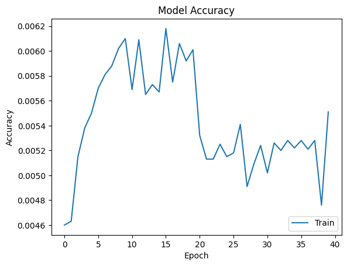

# Vision Transformer Paper Reproduction and Fine-Tuning (2020)

## Introduction
This project reproduces and fine-tunes the original Vision Transformer (ViT) architecture as described in the original paper.

## Architecture Summary
| Stage               | Layer                | Type                    | Parameters                    | Output Shape  |
| ------------------- | -------------------- | ----------------------- | ----------------------------- | ------------- |
| Input               | Input                | Image Input             | –                             | 224 × 224 × 3 |
| **Patch Embedding** | Conv2D               | Conv (Patch Projection) | 768 filters, 16×16, stride 16 | 14 × 14 × 768 |
|                     | Reshape              | Flatten Patches         | –                             | 196 × 768     |
| **Embedding**       | CLS Token            | Learnable Token         | 1 × 1 × 768                   | 197 × 768     |
|                     | Position Embedding   | Learnable               | 197 × 768                     | 197 × 768     |
|                     | Dropout              | Dropout                 | p = 0.1                       | 197 × 768     |
| **Encoder ×12**     | LayerNorm            | Pre-Norm                | ε = 1e-6                      | 197 × 768     |
|                     | Multi-Head Attention | Self-Attention          | 12 heads, dₖ = 64             | 197 × 768     |
|                     | Dropout              | Dropout                 | p = 0.1                       | 197 × 768     |
|                     | Residual             | Skip Connection         | –                             | 197 × 768     |
|                     | LayerNorm            | Pre-Norm                | ε = 1e-6                      | 197 × 768     |
|                     | Dense                | MLP (Expansion)         | 3072 (4×768), GELU            | 197 × 3072    |
|                     | Dense                | MLP (Projection)        | 768                           | 197 × 768     |
|                     | Dropout              | Dropout                 | p = 0.1                       | 197 × 768     |
|                     | Residual             | Skip Connection         | –                             | 197 × 768     |
| **Output Head**     | LayerNorm            | Final Norm              | ε = 1e-6                      | 197 × 768     |
|                     | CLS Select           | Token Extraction        | –                             | 768           |
|                     | Dense                | Classification Head     | 200 classes                   | 200           |

## Dataset
### Reproduction
tiny-imagenet-200 is used as the dataset in this reproduction. Validation set is used as test set, as the actual test set is not labelled. Each image is resized from 64 * 64 to 256 * 256 and randomly crop an 224 * 224 image from it. The images are later normalised across the RGB channels with mean (0.5, 0.5, 0.5) and standard deviation (0.5, 0.5, 0.5), which aligns with the Hugging Face model repository (google/vit-base-patch16-224-in21k; Hugging Face, 2026)

### Fine-Tuning
We fine-tune the the Hugging Face model repository (google/vit-base-patch16-224-in21k; Hugging Face, 2026). The preprocessing for fine-tuning stays same as reproduction to match the training data used in the Hugging Face model repository (google/vit-base-patch16-224-in21k; Hugging Face, 2026)

## Results
### Reproduction
It is really hard for the reproduced model to converge with this dataset. The loss decreases from 5.62 to 5.29 after 40 epochs and stays around 5.3 for 37 epochs. Moreover, accuracy also doesn't increase.

### Fine-tuning
We freeze pre-trained ViT model first and only train the classification head for 5 epochs. Then, we train the whole model for 20 epochs. After all this we achieve
| Metric            | Value |
| ----------------- | ----- |
| Training accuracy | 99.76% |
| Test accuracy     | 89.87% |

## Discussion
### Reproduction
It is expected that ViT hardly converges with this dataset. According to Dosovitskiy et al. (2020), ViT has low inductive bias, which means that it requires large amounts of training data to learn everything from scratch, such as locality. On the contrary, traditional conv net, such as VGG, already assumes locality, hierarchical feature composition and so on. As a result, small dataset like tiny-imagenet-200 is appropriate for traditional CNNs.

### Fine-Tuning
Unlike training ViT from scratch, the pre-trained model already learned visual patterns and spatial structures, which reduced the data requirements for fine-tuning. From the results, it can be found that the fine-tuned model converges lot more better than the reproduced one.

## References
Dosovitskiy, A., Beyer, L., Kolesnikov, A., Weissenborn, D., Zhai, X., Unterthiner, T., Dehghani, M., Minderer, M., Heigold, G., Gelly, S., Uszkoreit, J., & Houlsby, N. (2020). An image is worth 16×16 words: Transformers for image recognition at scale. *arXiv*. https://arxiv.org/abs/2010.11929

Hugging Face. (n.d.). google/vit-base-patch16-224-in21k [Model]. Hugging Face. Retrieved January 22, 2026, from https://huggingface.co/google/vit-base-patch16-224-in21k

Tiny ImageNet Dataset
Wu, J., Zhang, J., Xie, Y., & others. (2017).
Tiny ImageNet Visual Recognition Challenge.
Stanford University.
https://tiny-imagenet.herokuapp.com/
